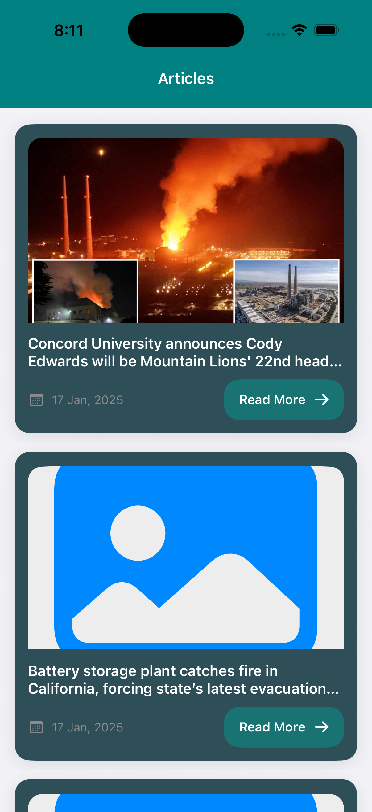
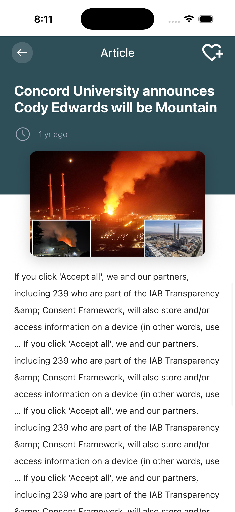
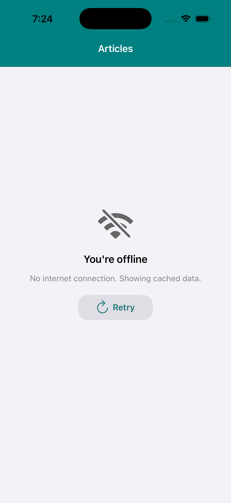

# ArticlesApp

A production-style iOS application built using Swift and UIKit that fetches, caches and displays articles from a remote API. 
The project showcases clean layered architecture, SOLID principles, dependency injection with Swinject and an offline-first user experience.

---

## Screenshots

### Article List | Article Detail | Offline State

| Article List | Article Detail | Offline |
|---|---|---|
|  |  |  |

---

## Features

| Feature | Details |
|---|---|
| 📰 Article List | Fetches and displays articles from a remote API in a scrollable list |
| 📄 Article Detail | Full detail screen with title, time, image and article body |
| 🔄 Pull-to-Refresh | Swipe down to force-refresh the article list |
| 📡 Connectivity Detection | Detects online/offline state and reacts in real time |
| 💾 Offline Caching | Articles cached locally and served when device is offline |
| 🖼️ Image Loading & Prefetch | Smooth image loading with scroll-ahead prefetching |
| ↩️ Retry State | Retry button shown when network fails and no cache exists |
| 🫙 Empty State | Dedicated empty state UI when no articles are available |
| 📋 Production Logging | Multi-destination logging to console and file |

---

## Architecture

The project follows a **strict layered architecture** with clear separation of concerns. Each layer has a single defined responsibility and communicates only with the layer directly below it.

```
┌─────────────────────────────────────────────┐
│              ViewControllers                │  UI logic only. No networking.
├─────────────────────────────────────────────┤
│                 Managers                    │  Business logic. Cache vs network decisions.
├─────────────────────────────────────────────┤
│                 Providers                   │  API calls only. No business logic.
├─────────────────────────────────────────────┤
│              Network Client                 │  Alamofire session. Maps errors.
├─────────────────────────────────────────────┤
│                  Models                     │  Codable entities. Zero logic.
└─────────────────────────────────────────────┘
```

### Layer Responsibilities

| Layer | Responsibility |
|---|---|
| `Application` | App bootstrap, SceneDelegate, DI container (Composition Root) |
| `Models/Entities` | Codable data models (`Article`, `ArticleSource`) |
| `Models/ProviderProtocols` | Protocol contracts for all providers |
| `Provider/Client` | NetworkClient, NetworkLogger, APIEndpoints, error mapping |
| `Provider/Core` | `ArticleProvider` — performs API requests only |
| `Managers/Client` | CacheManager, ImageLoader, AppLogger, AppConstants, Environment |
| `Managers/Core` | `ArticleManager` — owns cache-first/offline decision logic |
| `ViewControllers/Client` | Router, ToastManager, AlertManager |
| `ViewControllers/Core` | ArticleList and ArticleDetail screens + cells |
| `Views/Components` | Reusable programmatic UI: LoadingIndicatorView, EmptyStateView, RetryView |

### Architectural Rules

#### Protocol-First Design
Every service is defined by a protocol before its implementation. This makes all layers swappable, mockable and testable without touching consumers.

```swift
protocol ArticleManagerProtocol {
    func getArticles(forceRefresh: Bool,
                     completion: @escaping (Result<[Article], NetworkError>) -> Void)
}
```

#### Thin ViewControllers
ViewControllers contain **only UI logic**. They receive data, apply ViewState and delegate all decisions to the Manager layer. No URL strings, no JSON, no cache keys.

#### Dependency Injection — Swinject
All dependencies are assembled in a single **Composition Root** — `AppDIContainer.swift`. No service locator calls inside ViewControllers. All dependencies flow in through initialiser injection or property injection at resolve time.

```swift
// All wiring happens here — nothing else calls the container
container.register(ArticleManagerProtocol.self) { r in
    ArticleManager(
        provider:     r.resolve(ArticleProviderProtocol.self)!,
        cache:        r.resolve(CacheManagerProtocol.self)!,
        reachability: r.resolve(ReachabilityManagerProtocol.self)!
    )
}.inObjectScope(.container)
```

#### View State Machine
Each screen uses a `ViewState` enum to drive UI rendering. There is no scattered `isHidden` logic — one `applyState()` method handles the entire screen state.

```swift
enum ArticleListViewState {
    case idle
    case loading
    case success([Article])
    case empty
    case error(String)
}
```

#### Separation of Networking and Business Logic
- `ArticleProvider` — knows only how to call the API
- `ArticleManager` — knows only when to use the network vs cache
- `NetworkClient` — knows only how to execute HTTP requests and map errors

---

## Folder Structure

```
ArticlesApp/
│
├── Application/
│   ├── AppDelegate.swift
│   ├── SceneDelegate.swift
│   └── AppDIContainer.swift            ← Composition Root
│
├── Models/
│   ├── Entities/
│   │   └── Article.swift               ← Codable models
│   └── ProviderProtocols/
│       └── ArticleProviderProtocol.swift
│
├── Provider/
│   ├── Client/
│   │   ├── NetworkClient.swift
│   │   ├── NetworkLogger.swift         ← Alamofire EventMonitor
│   │   ├── ReachabilityManager.swift
│   │   ├── APIEndpoints.swift
│   │   ├── APIError.swift
│   │   └── NetworkError.swift
│   └── Core/
│       └── ArticleProvider.swift
│
├── Managers/
│   ├── Client/
│   │   ├── CacheManager.swift          ← Cache library wrapper
│   │   ├── AppConstants.swift
│   │   ├── AppLogger.swift             ← XCGLogger wrapper
│   │   ├── ImageLoader.swift           ← Kingfisher wrapper
│   │   ├── Environment.swift
│   │   └── APIConfig.swift
│   └── Core/
│       └── ArticleManager.swift        ← Cache vs network decisions
│
├── ViewControllers/
│   ├── Client/
│   │   ├── Router.swift
│   │   ├── ToastManager.swift          ← Loaf wrapper
│   │   └── AlertManager.swift
│   └── Core/
│       ├── ArticleList/
│       │   ├── ArticleListViewController.swift
│       │   ├── ArticleListViewState.swift
│       │   ├── Cells/
│       │   │   └── ArticleTableViewCell.swift
│       │   └── Views/
│       │       └── ArticleTableViewCell.xib
│       └── ArticleDetail/
│           ├── ArticleDetailViewController.swift
│           └── ArticleDetailViewState.swift
│
├── Views/
│   ├── Storyboards/
│   │   └── Main.storyboard
│   └── Components/
│       ├── LoadingIndicatorView.swift   ← Programmatic reusable
│       ├── EmptyStateView.swift
│       └── RetryView.swift
│
├── Resources/
│   └── Assets.xcassets/
│
├── Screenshots/
│   ├── article_list.png
│   ├── article_detail.png
│   └── offline.png
│
└── SupportingFiles/
    └── LaunchScreen.storyboard
```

---

## Tech Stack

| Library | Version | Purpose |
|---|---|---|
| **Alamofire** | ~5.9 | HTTP networking with request validation and response serialisation |
| **AlamofireNetworkActivityIndicator** | ~3.1 | Shows network activity indicator in status bar automatically |
| **Cache** | ~6.0 | Type-safe disk + memory caching for API response persistence |
| **ReachabilitySwift** | ~5.2 | Network connectivity monitoring and change notifications |
| **Kingfisher** | ~8.1 | Async image downloading, caching, prefetching, and transitions |
| **XCGLogger** | ~7.0 | Production-grade multi-destination logging (console + file) |
| **Swinject** | ~2.8 | Dependency injection container and Composition Root |
| **FTLinearActivityIndicator** | ~1.3 | Linear network activity indicator for iPhone notch devices |
| **KMNavigationBarTransition** | ~1.1 | Smooth navigation bar transitions between teal and default bars |
| **Loaf** | ~0.6 | Lightweight toast notifications for connectivity and error states |

---

## Networking

All networking runs through a single `NetworkClient` backed by an Alamofire `Session`. The session is configured with:
- 30-second request timeout
- `NetworkLogger` plugged in as an `EventMonitor` — logs every request, response, status code and timing
- Response validation restricted to `200..<300` — all other codes mapped to typed `NetworkError`

```
Request → NetworkClient → Alamofire Session → API
                                    ↓
Response → Validate → Decode → Result<T, NetworkError>
                                    ↓
                          ArticleProvider returns to ArticleManager
```

---

## Caching Strategy

Caching is handled entirely inside `ArticleManager`. The ViewController never knows whether data came from network or cache.

```
getArticles(forceRefresh: false)
        │
        ├─ Offline?  → load cache → serve (or show error if empty)
        │
        ├─ Cache hit AND not forceRefresh? → serve cached articles
        │
        └─ Network fetch
                ├─ Success → save to cache → serve fresh articles
                └─ Failure → try stale cache → serve (or surface error)
```

- **Cache library** uses dual storage: memory (5 min) + disk (1 hour, 10 MB max)
- Cache key: `com.articlesapp.cache.articles`
- Stale cache is served as a graceful fallback on any network failure
- Cache is updated on every successful API response

---

## Connectivity Handling

`ReachabilityManager` wraps `ReachabilitySwift` and exposes:
- `isConnected: Bool` — synchronous check before any network call
- `onConnectionChanged: ((Bool) -> Void)?` — fires on every state change

When the device goes **offline**:
1. A `Loaf` toast is shown: *"You're offline. Showing cached data."*
2. `ArticleManager` serves cached articles if available
3. `RetryView` is shown only when both network and cache are unavailable

When the device comes back **online**:
1. `ArticleListViewController` automatically triggers a silent background refresh
2. Fresh articles replace the cached data in the UI

---

## Logging

`AppLogger` wraps `XCGLogger` and provides a singleton with typed log methods. Two destinations are configured:

| Destination | Level | Output |
|---|---|---|
| Console | DEBUG (dev) / WARNING (prod) | Xcode console with file + line numbers |
| File | WARNING always | `Documents/ArticlesApp.log` — survives app restarts |

Every network request, cache read/write and state change is logged with context.

---

## Extra UX Features

### Pull-to-Refresh
`UIRefreshControl` attached to the `UITableView`. Swipe down triggers `getArticles(forceRefresh: true)` through `ArticleManager`, bypassing the cache.

### Empty State
`EmptyStateView` — a reusable programmatic component shown when the API returns zero valid articles. The table view is hidden and the empty state fills the screen.

### Image Prefetching
`ImageLoader` wraps Kingfisher's `ImagePrefetcher`. The `UITableViewDataSourcePrefetching` protocol is adopted in `ArticleListViewController` — images for upcoming cells are downloaded before they scroll into view.

### Retry Button
`RetryView` — a reusable programmatic component shown when a network request fails and no cached data exists. The retry button fires `getArticles(forceRefresh: true)` through the existing manager path.

---

## Setup Instructions

### Requirements

- Xcode 16.0+
- iOS 18.0+
- CocoaPods

### Steps

```bash
# 1. Clone the repository
git clone https://github.com/mitultarsariya/ios-articles-clean-architecture.git
cd ios-articles-clean-architecture

# 2. Install dependencies
pod install

# 3. Open the workspace (NOT the .xcodeproj)
open ArticlesApp.xcworkspace

# 4. Select a simulator or device and build
# ⌘ + R
```

> ⚠️ Always open the `.xcworkspace` file after running `pod install`. Opening `.xcodeproj` directly will cause missing framework errors.

---

## Architecture Decisions

### Why Layered Architecture?
Each layer has a single job. A change in the API response format only touches `Article.swift` and `ArticleProvider.swift` — nothing else. A UI redesign touches only `ViewControllers` and `Views`. Layers can be replaced independently.

### Why Dependency Injection with Swinject?
Constructor injection makes dependencies explicit and visible. `AppDIContainer` is the single place where the object graph is assembled. This eliminates hidden dependencies, makes testing straightforward and prevents global state.

### Why Protocol-Based Design?
Every service behind a protocol means:
- Any implementation can be swapped without touching callers
- Mock implementations can be injected during testing
- The compiler enforces the contract

### Why Cache-First Strategy?
Users on slow or intermittent networks get instant data from cache while the network request runs. On failure, stale cache prevents a jarring empty screen. Fresh data updates the cache transparently.

### Why Kingfisher for Images?
Kingfisher handles the full image pipeline out of the box: download queuing, memory + disk caching, downsampling, fade transitions, and prefetching. `ImageLoader` wraps it so the rest of the app never imports Kingfisher directly — the dependency can be swapped without touching any ViewController or cell.

---

## Future Improvements

- [ ] Unit tests for `ArticleManager` and `ArticleProvider` using mock dependencies
- [ ] Repository layer between Manager and Provider for better data abstraction

---
